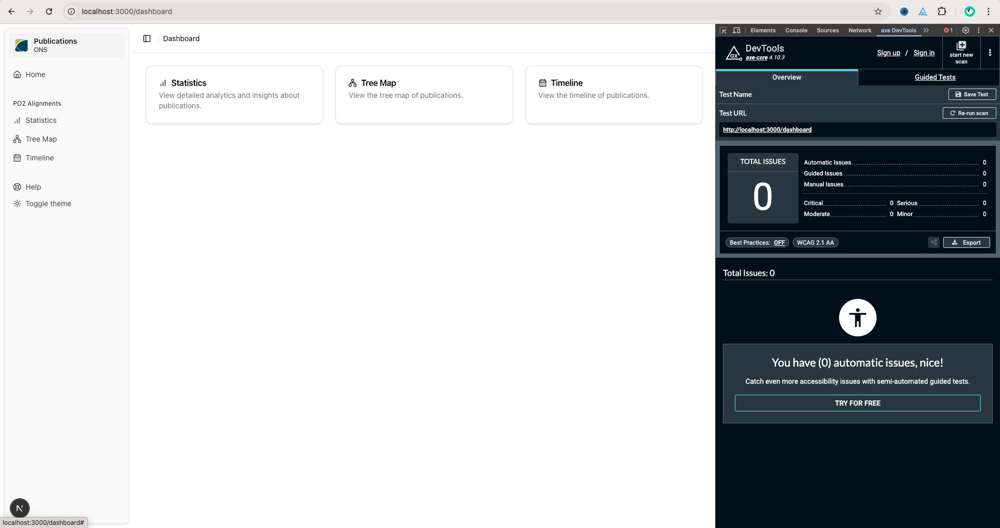

# PlayWright & Axe-Core Testing

WCAG means the Web Content Accessibility Guidelines. By default, the tests run the latest version of WCAG2.0 and WCAG2.1. To run different tests, you can use specific tags when running with `node test.js {tag1} {tag2}`. You can view all compatible axe-core tags [here](https://www.deque.com/axe/core-documentation/api-documentation/#axecore-tags).


## Prerequisities

1. App is running on `http://localhost:3000`
2. Node and npm are installed

## Installation

Install dependencies and playwright browsers:

```bash
make setup
```

## Running

Run the default `wcag2a wcag2aa wcag21a wcag21aa` tests after setting up:

```bash
make test
```

Reports will be generated in `testing/reports/{timestamp of run}`.

An individual JSON file with the full axe scan is outputted here. e.g. `JSON/report-{page}.json`.

For an easier to read version of the whole app scan, see the `report.html` and `report.md`.

To view examples of the layout, see `/testing/example_reports` where a `report.html` and `report.md` are generated.


### Testing specific tags

Alternatively, you can run the tests with all available axe-core tags:

```bash
make test-all
```

Please note that this will most likely throw a lot of moderate and minor violations that don't need to be fixed.

You can also test specific tags by running:

```bash
node test.js {tag1} {tag2}
```

View all compatible axe-core tags [here](https://www.deque.com/axe/core-documentation/api-documentation/#axecore-tags).


## Axe DevTools

Whilst this is automated testing, it can be easier to install the free axe DevTools Chrome extension to run scans directly in the browser. Although, you cannot generate reports from the free version of the extension, so reports can be generated here.

Download the extension from [here](https://chromewebstore.google.com/detail/axe-devtools-web-accessib/lhdoppojpmngadmnindnejefpokejbdd).

| axe DevTools Screenshot |
| --- |
|  |

## Cleaning

After tests have finished, remove the /reports folder by using:

```bash
make clean
```